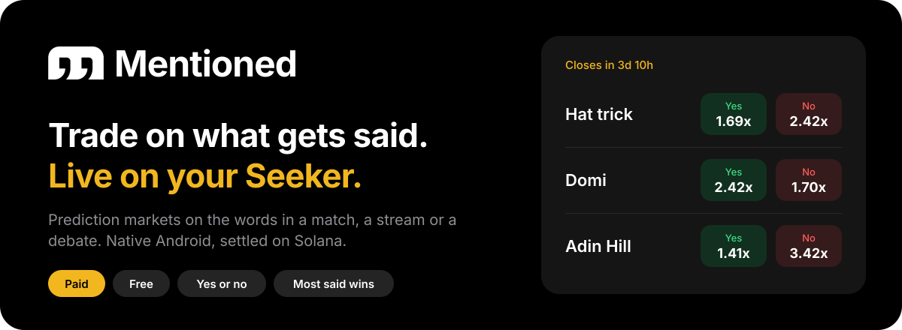
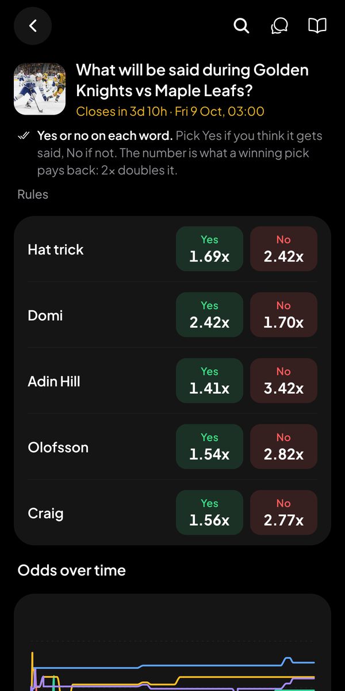
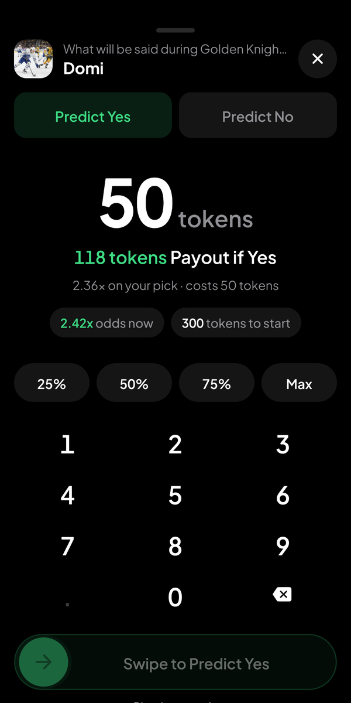
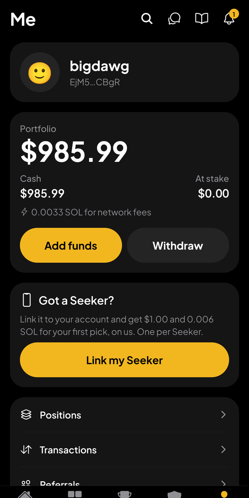
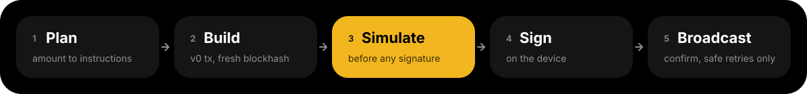

<p align="center">
  
</p>

<p align="center">
  <a href="https://github.com/Mentioned-Market/mentioned-mobile/actions/workflows/test.yml"></a>
  
  
  
  
</p>

<p align="center">
  <a href="https://www.mentioned.market">mentioned.market</a>
  &nbsp;·&nbsp;
  <a href="https://docs.mentioned.market/what-is-mentioned/">How the game works</a>
  &nbsp;·&nbsp;
  <a href="docs/ENGINEERING.md">Engineering notes</a>
  &nbsp;·&nbsp;
  <a href="docs/DESIGN.md">Design system</a>
</p>

# Mentioned Mobile

**Mentioned is a second-screen game for live events.** You are watching a
match, a stream or a debate, and you make a pick on what gets said: whether a
word is said at all, or which word is said the most. When the event ends the
market resolves and the winners are paid.

This repository is the native Android app for the Solana Seeker, built for the
CLOCK IN hackathon and submitted to the Solana dApp Store on Oct 4 2026. It is
not a wrapped website. Every transaction is built, simulated and signed on the
phone, and the Seeker itself is part of the product: its Seed Vault funds the
account, and its Genesis Token proves the person is holding a real one.

<table>
  <tr>
    <td align="center" width="33%"></td>
    <td align="center" width="33%"></td>
    <td align="center" width="33%"></td>
  </tr>
  <tr>
    <td align="center"><b>Pick a word</b><br>Every word in the event, with what a winning pick pays back.</td>
    <td align="center"><b>Swipe to confirm</b><br>The payout before you commit, and one swipe to place it.</td>
    <td align="center"><b>Link your Seeker</b><br>Fund from the Seed Vault and get your first pick on us.</td>
  </tr>
</table>

## Built for the Seeker

| | What it does | Where |
|---|---|---|
| **Seed Vault funding** | A deposit is authorized, built, simulated and signed in one Mobile Wallet Adapter session, so the person approves once with the Seeker's double tap. Withdrawals default back to the same wallet. | [`src/chain/mwa.ts`](src/chain/mwa.ts), [`src/ui/fund-sheet.tsx`](src/ui/fund-sheet.tsx) |
| **Seeker Genesis Token check** | The Seed Vault wallet signs one message naming the account. The server verifies it, then checks on mainnet that the wallet holds a Genesis Token. A model string can be faked; the token cannot. | [`src/lib/use-seeker-flow.ts`](src/lib/use-seeker-flow.ts), [`src/lib/seekerLinkMessage.ts`](src/lib/seekerLinkMessage.ts) |
| **A first pick, on us** | A verified Seeker gets one pick on a paid market paid for. The funding and the pick are one transaction, so it can only become a position, never cash. It is keyed on the token's mint: once per Seeker, however many accounts its owner makes. | [`src/trade/seeker-pick.ts`](src/trade/seeker-pick.ts), [`src/lib/seeker-perk.ts`](src/lib/seeker-perk.ts) |
| **No wallet pop-up per trade** | An embedded wallet signs trades inside the app, so a pick during a live event is one swipe. The Seed Vault is the bank, not the checkout. | [`src/auth/signer.ts`](src/auth/signer.ts), [`src/trade/send.ts`](src/trade/send.ts) |
| **Push that lands on the market** | Firebase push for resolutions and new markets, each one translated into an app route so a tap opens the right screen. | [`src/notifications/`](src/notifications/) |
| **Verified App Links** | A `mentioned.market` link to a market, a free market or a referral opens the app with no chooser. | [`app.json`](app.json) |
| **Made for a thumb** | Haptics on every commit and selection, swipe between tabs, swipe to confirm, a number pad instead of a keyboard, and every animation off under reduce motion. | [`src/ui/`](src/ui/), [`docs/DESIGN.md`](docs/DESIGN.md) |
| **Opens instantly** | The query cache is persisted to disk, so a cold launch shows the last known markets instead of skeletons while the network answers. | [`src/api/persist.ts`](src/api/persist.ts) |
| **dApp Store release** | Store-signed APK under `market.mentioned.app`, with a remote minimum version and kill switch so a shipped build can still be steered. | [`dapp-store/README.md`](dapp-store/README.md), [`docs/REMOTE_CONFIG.md`](docs/REMOTE_CONFIG.md) |

## On Solana

Paid markets are two on-chain programs on mainnet, settled in USDC:

| Program | Market | Mainnet address |
|---|---|---|
| `mention-market-usdc-amm` | Paid yes or no: an LMSR market maker, buy, sell and redeem | [`7pL3oze39xX7NmGFtndTz3EjhkCP9AcoVtX6fVmxm9pn`](https://solscan.io/account/7pL3oze39xX7NmGFtndTz3EjhkCP9AcoVtX6fVmxm9pn) |
| `mention-majority-market` | Paid most said wins: a shared pool, paid to the top word or the top three | [`F1AVzZe4oX2cNDTvJjNFGWyYz4uxXxMwEqvTnamA2j9r`](https://solscan.io/account/F1AVzZe4oX2cNDTvJjNFGWyYz4uxXxMwEqvTnamA2j9r) |

What the app does on the network itself, with `@solana/kit`:

- **Reads accounts directly.** Market, position and pool accounts are fetched
  and decoded on the device ([`src/chain/`](src/chain/)), and the prices on
  screen come from the same maths the program runs.
- **Builds every transaction on the phone.** v0 transactions with a fresh
  blockhash and a compute limit, PDAs derived locally.
- **Simulates before it asks for a signature.** A locked market or a short
  balance is named before the person approves anything and before a fee is
  spent.
- **Treats a timeout as "may still land".** Signed bytes can be re-broadcast
  safely; a trade is never posted twice.
- **Shows its work.** Deposits, withdrawals and the welcome stake are read back
  from the chain, and every row opens on Solscan
  ([`src/app/transactions.tsx`](src/app/transactions.tsx)).

<p align="center">
  
</p>

## What is in the app

- **Four kinds of market.** Paid or free, each as "yes or no" on a word or
  "most said wins" across a board. Free markets are played with tokens and
  earn points, so anyone can play before funding a wallet.
- **Sign in with Google, X or an email code.** No seed phrase to write down.
- **Live numbers.** Multipliers and pools update in place, flash the way they
  moved, and a market in its last hour counts down by the second.
- **Chat** in every market and one global room, live over the website's event
  stream.
- **Ranks and Arena.** A weekly leaderboard, team seasons with medals, and
  referrals.
- **A reason to come back.** A notification feed, push when a market resolves,
  a win moment when a pick pays, and a share card for the result.

## Where to look

- [`docs/ENGINEERING.md`](docs/ENGINEERING.md) is the tour: how a trade
  actually works, and the problems that shaped the code. Start there for a
  code review.
- [`docs/DESIGN.md`](docs/DESIGN.md) is the design system: the rules every
  screen follows, and the components in `src/ui/` that enforce them.
- [`docs/SPEC.md`](docs/SPEC.md) is the plan, version by version.
- [`docs/V0_GUIDE.md`](docs/V0_GUIDE.md) is the original build order and the
  port table.

## Run on a Seeker

Prerequisites (guide section 1): Node 24 (see `.nvmrc`; npm 11 writes the
lockfile and npm 10 will not install it), JDK 17, Android Studio with SDK
Platform 34+, `ANDROID_HOME` set, `platform-tools` on `PATH`, USB debugging on
the Seeker and `adb devices` listing it.

```bash
npm install
npx expo run:android --device   # pick the Seeker
```

Metro serves JS over USB. The API is a deployed environment, so nothing else
runs locally. Rebuild only when native dependencies change; everything else is
fast refresh.

The `android/` directory is generated by `npx expo prebuild --platform android`
and is committed so builds are reproducible. Release keystores are never
committed.

## Layout

- `index.js` installs the crypto polyfill, then hands off to expo-router.
- `polyfill.js` runs `react-native-quick-crypto` before any Solana import.
  Hermes has no `crypto.subtle`, which `@solana/kit` needs to derive PDAs.
- `src/app/` expo-router screens. Layout and state wiring, little else.
- `src/api/` one typed client per route group, every response parsed by zod,
  plus the TanStack Query wrappers and the on-disk query cache.
- `src/chain/` account decoding, instruction building, RPC send and confirm.
  Mostly ported from the web repo.
- `src/trade/` the app's own trade path: plan, simulate, sign, broadcast, and
  the rules around it (spending cap, claim batching).
- `src/auth/` Openfort provider, Shield encryption session, session exchange.
- `src/markets/`, `src/free/`, `src/arena/`, `src/lib/` pure logic: merging,
  maths, formatting, derivations. No React, so it is unit tested.
- `src/ui/` shared components and the theme. `docs/DESIGN.md` says how they
  fit together; start there before adding a screen.

What changes on the website's schedule is read from the website, not compiled
in: markets, standings, Arena seasons and medals (`/api/teams/arenas`,
`/api/teams/bounties`), point values, and whether this build may still run
(`/api/mobile/config`). To make every phone update, set `MOBILE_MIN_VERSION` on
the web service to the version that is live in the dApp Store, after it is
live. `docs/REMOTE_CONFIG.md` is the how-to; `docs/ENGINEERING.md` has the
reasoning.

## Flavours

`EXPO_PUBLIC_FLAVOR` picks the API, cluster, program ids and mint together, as
one set. Anything other than an exact known non-live name resolves to
production, so a typo or an unset value fails safe to the live configuration
rather than to a half-configured environment.

| Flavour | API | Cluster | Used for |
|---|---|---|---|
| `production` (default) | `www.mentioned.market` | mainnet | the real app |
| `devnet` | `mentioned-web-dev-dev.up.railway.app` | devnet | trading against the merged Openfort code |
| `staging` | `mentioned-staging.up.railway.app` | devnet | the same, plus the notification worker, so push and the feed are tested here |

**Always clear the Metro cache when switching flavour.** Metro caches the
inlined value, so a production build made straight after a devnet build will
silently carry devnet config. `npm run bundle:devnet`, `npm run bundle:staging`
and `npm run bundle:production` pass `--clear` for you; a Gradle release build
needs the same care.

Every launch logs `[flavour] <name> -> <api base>`, and a non-production build
shows the flavour as a pill next to the wordmark on Home, so a wrong build is
obvious rather than silent.

## Configuration and secrets

`src/config.ts` holds everything that ships inside the APK: API base, RPC proxy
URL, program ids, the USDC mint. No secret belongs in it, because anything in a
build is readable by anyone who has the build.

Two publishable Openfort keys and two public Privy ids come from the
environment, set per profile in `eas.json` and locally in `.env.local`
(gitignored):

```
EXPO_PUBLIC_FLAVOR=staging
EXPO_PUBLIC_OPENFORT_PUBLISHABLE_KEY=...
EXPO_PUBLIC_OPENFORT_SHIELD_PUBLISHABLE_KEY=...
EXPO_PUBLIC_PRIVY_APP_ID=...
EXPO_PUBLIC_PRIVY_CLIENT_ID=...
```

All four are public by design. The Shield and server secrets stay behind
`/api/openfort/encryption-session` on the website. With the Openfort keys
absent the Openfort provider renders inert and the app still runs read-only,
which is why a build without them does not crash.

Privy is only for accounts made before the move to Openfort; new accounts are
always Openfort (see `docs/ENGINEERING.md`). The app id is the website's
`NEXT_PUBLIC_PRIVY_APP_ID`. The client id is for an app client created in the
Privy dashboard for the Android app, which must allow the package
`market.mentioned.app` and the URL scheme `mentioned`. Without the two ids, a
legacy account is told to use the website instead.

`google-services.json` is committed because the Android build needs it; its API
key is a client key, restricted to this package name and signing certificate
in the Google Cloud console. The Firebase admin service
account key is a real secret: it is gitignored, has never been committed, and
belongs only on the server.

## How a trade works

The path is one call for a screen, in [`src/trade/send.ts`](src/trade/send.ts):

1. **Plan.** `src/trade/amm.ts` or `majority.ts` turns an amount into
   instructions using the ported market maths against the decoded account.
2. **Build.** Compile a v0 transaction with a fresh blockhash and a compute
   limit.
3. **Simulate, before anything is signed.** Simulation needs no signature, so a
   locked market or a balance that is short is named before the user is asked
   to approve and before a fee is spent. Anchor puts the readable reason in the
   program logs, so the logs are mined for it.
4. **Sign.** `src/auth/signer.ts` signs the canonical message bytes and places
   the signature in kit's signature map. The transaction is never spliced by
   hand. A signature that is not exactly 64 bytes, or a wallet that is not a
   required signer, is refused rather than broadcast.
5. **Broadcast and confirm** through the website's RPC proxy, retrying only
   what is safe to retry.

Before any of that, a real-money trade or an Arena entry asks for the website's
integrity confirmation if the wallet still owes one: a short checklist, once in
full and then one line per market
([`src/trade/use-attestation-gate.tsx`](src/trade/use-attestation-gate.tsx)).
The website refuses to broadcast without it. It needs a live session, so a
lapsed one is asked to sign in again.

A confirmation timeout is reported as "may still land", never as a failure. A
basket that is split across transactions reports how many parts went through,
so nothing is paid for twice. See `docs/ENGINEERING.md` for why each of those
is the way it is.

## Tests

```bash
npm test          # 1001 unit tests, offline, against captured fixtures
npm run typecheck # tsc --noEmit
npm run lint
npm run contract  # every public route parsed against the live API
npm run smoke     # the V0_GUIDE section 5 checks against live data
npm run fixtures  # re-capture test/fixtures from the API
```

`npm test` needs no network: `test/fixtures/` holds real responses frozen by
`npm run fixtures`. Re-capture them when a route legitimately changes shape,
which is what the contract test tells you.

The chain path has its own read-only tools. Each builds real instructions and
simulates them against the configured cluster, and none of them signs anything,
so instruction encoding and account ordering are proven before a wallet is ever
involved:

```bash
WALLET=<address> npx tsx scripts/try-buy.ts        # a paid YES/NO buy
WALLET=<address> npx tsx scripts/try-majority.ts   # a majority basket
WALLET=<address> npx tsx scripts/try-claim.ts      # claims on resolved markets
WALLET=<address> npx tsx scripts/check-resolved.ts # what is claimable, read-only
BASE=<api base>  npx tsx scripts/probe-env.ts      # which chain a deployment runs
```

## CI

- `test.yml` runs typecheck, lint and the unit tests on every pull request and
  every push to `main`. This is the only gate on a merge.
- `contract.yml` parses every public route against production once a day, and
  opens or updates an issue labelled `contract-failure` when a shape changes.
  It closes the issue when the route is good again. A shipped APK cannot be
  patched quickly, so the app has to hear about a web change the day it lands.
- `claude-review.yml` posts advisory AI review comments on a pull request, and
  `claude.yml` answers `@claude` mentions. Neither can block a merge.

## Ported code

Roughly 4.0k lines of `src/` are ported from the web repo and about 22.6k are
written for this app. Any ported file starts with a header naming its source
and the commit it was taken from:

```
// PORTED_FROM mentioned/lib/mentionMarketUsdc.ts @ ae8c82e
// Keep byte-identical to the web copy. If the program changes, change both.
// Mobile edits: imports only (config, ./rpcSend, ./fetchRetry).
```

Nothing else in a ported file changes, so a diff against the web copy stays
readable. The port table in `docs/V0_GUIDE.md` section 5 lists every edit. The
maths that prices a trade and the bytes that address a program must agree with
the website exactly, so they are shared rather than reimplemented.

## Versions

`@solana/kit` is pinned to 7.x because
`@solana-mobile/mobile-wallet-adapter-protocol-kit` peers on `^7.0.0`. Solana
packages are pinned to exact versions.

## Contributing

`AGENTS.md` holds the conventions: commit style, where logic belongs, and what
to update when behaviour changes. Run `npm test`, `npm run typecheck` and
`npm run lint` before committing.

## Release build

A release APK bundles the JavaScript, so it runs on any Android phone (7.0+,
64-bit ARM) with no Metro. The flavour is inlined at build time.

```bash
npm run apk:staging       # dist/mentioned-staging-<version>-<date>.apk
npm run apk:production    # dist/mentioned-production-<version>-<date>.apk
```

`scripts/release-apk.sh` sets `EXPO_PUBLIC_FLAVOR` for the build by writing a
temporary `.env.local` (Expo reads that file over the shell) and restores the
original afterwards, then checks the bundle carries the flavour's API host.

**Signing.** Release builds are signed with the store key when
`android/keystore.properties` exists (gitignored):

```
storeFile=/absolute/path/to/mentioned-store.keystore
storePassword=...
keyAlias=mentioned
keyPassword=...
```

Generate the key once and keep it in the team password manager; the store
rejects an APK signed with a Play key, and the key's SHA-256 is what goes into
the website's `/.well-known/assetlinks.json`:

```bash
keytool -genkeypair -v -keystore mentioned-store.keystore -alias mentioned \
  -keyalg RSA -keysize 4096 -validity 10000
keytool -list -v -keystore mentioned-store.keystore -alias mentioned | grep SHA256
```

Without the properties file a release build falls back to the debug key, and
Gradle warns that the APK is not shippable.

**Store.** See `dapp-store/README.md`. The CLI publishes to the portal; the
app and its listing are created there first.

## Deep links

The app opens `https://www.mentioned.market` links for `/market/<id>`,
`/paidmajority/<id>`, `/free/<slug>`, `/ref/<code>` and `/onramp/return`
(`app.json` `android.intentFilters`, mirrored in the committed
`AndroidManifest.xml`). They are verified App Links, so they open the app with
no chooser, only once the website serves `assetlinks.json` for the release
certificate; until then Android offers the browser too. `/ref/<code>` stores
the code and sends it once with the next sign-in. The `mentioned://` scheme
carries the same paths for testing:

```bash
adb shell am start -a android.intent.action.VIEW -d "mentioned://market/123" market.mentioned.app
```
